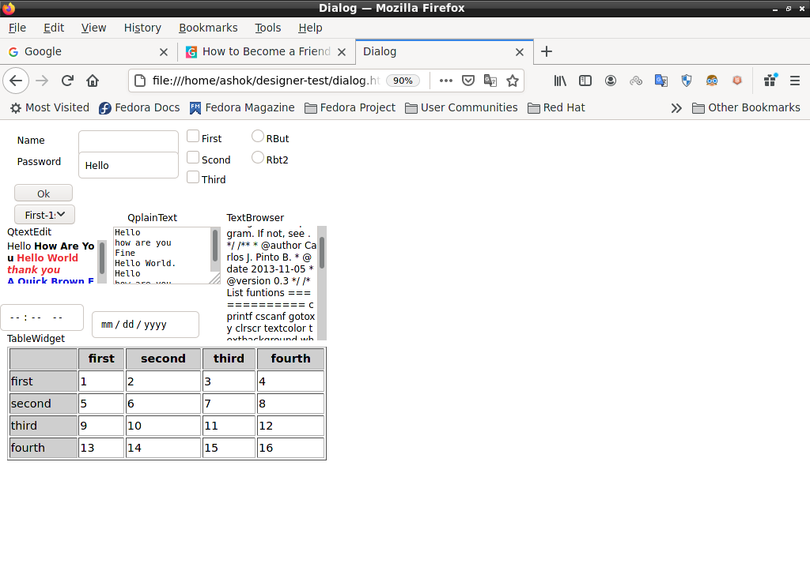
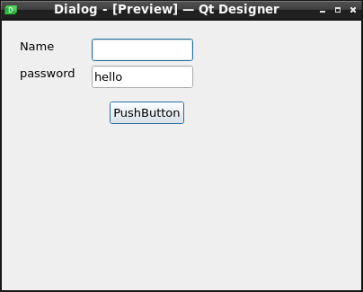
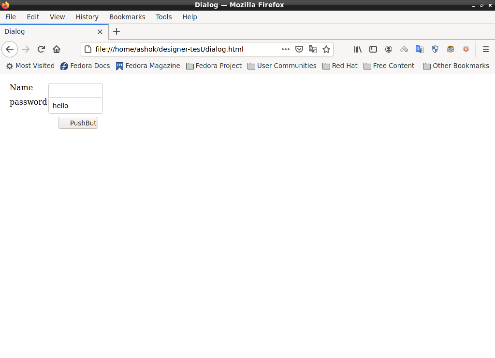
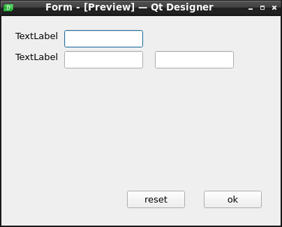
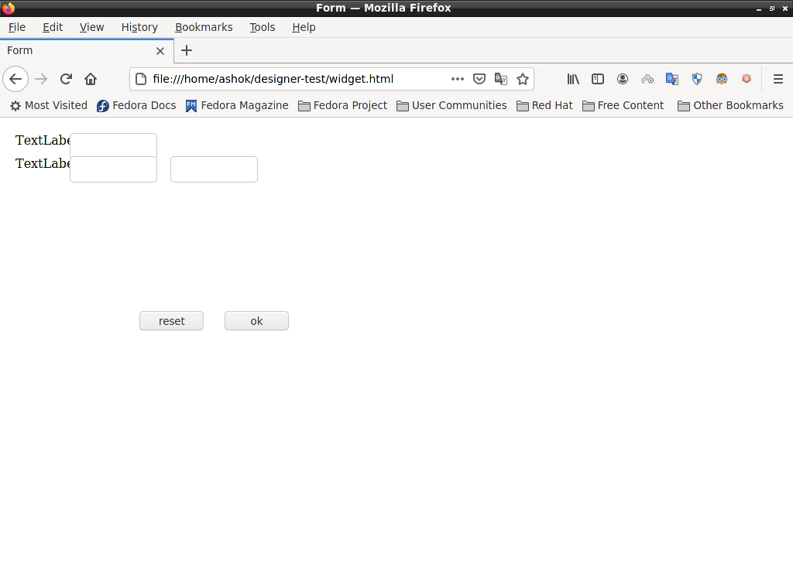
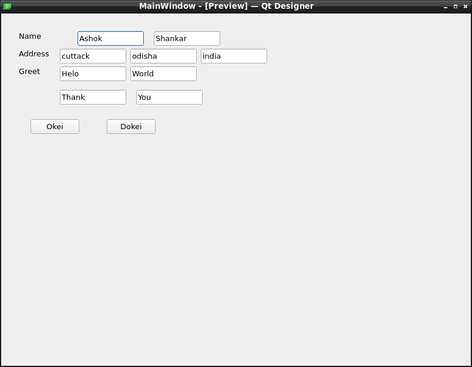
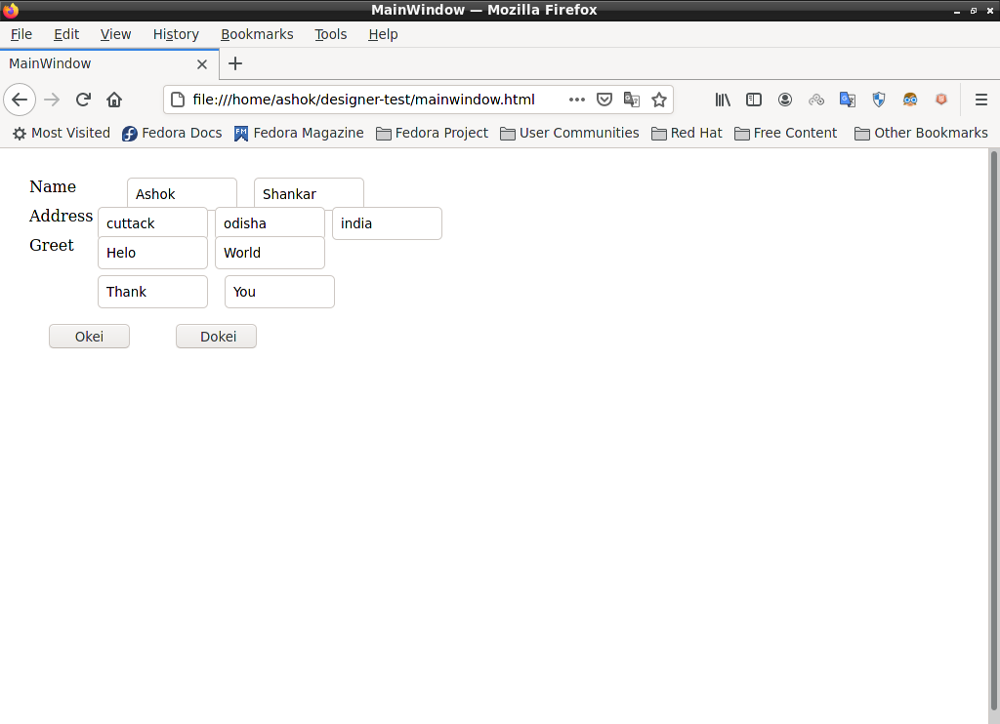

# Qt-to-HTML
Convert Qt Designer `.ui` files into HTML forms — no web development skills needed!

Designing HTML forms is painful if you're not a web developer. If you already know how to make forms in **Qt Designer** or **Qt Creator**, this tool lets you reuse that work and convert it directly to HTML.

---

## 📋 What It Does

This is a **command-line tool** that reads a Qt `.ui` file (created by Qt Designer or Qt Creator) and generates an equivalent **HTML form** with all your form elements converted automatically.

---

## ✅ Supported Widgets

| Qt Widget | Converted To |
|-----------|-------------|
| `QLabel` | `<label>` |
| `QLineEdit` | `<input type="text">` |
| `QPushButton` | `<input type="button">` (with JavaScript onclick) |
| `QCheckBox` | `<input type="checkbox">` |
| `QRadioButton` | `<input type="radio">` |
| `QComboBox` | `<select>` with `<option>` items |
| `QPlainTextEdit` | `<textarea>` |
| `QTextEdit` / `QTextBrowser` | `<div>` with rich HTML content |
| `QTableWidget` | `<table>` with rows and columns |
| `QDateEdit` | `<input type="date">` |
| `QTimeEdit` | `<input type="time">` |

**Main container support:** `QMainWindow`, `QDialog`, `QWidget`

> ⚠️ Layouts are not yet supported. Signal-slot connections generate placeholder JavaScript functions that you can edit later.

---

## 🔧 How to Download & Compile

### Step 1: Get Qt (if you don't have it already)

This tool is written in C++ and needs **Qt** to compile.

- **Option A:** Download from [qt.io](https://www.qt.io/download-open-source) — install version 6.x
- **Option B:** Already installed? Check by opening a terminal (PowerShell) and typing:

```powershell
C:\Qt\6.9.1\mingw_64\bin\qmake.exe --version
```

If you see a version number, you're good to go.

### Step 2: Open a terminal

1. Press `Windows Key + X` and select **Terminal** or **PowerShell**
2. Navigate to this project folder:

```powershell
cd "c:\Users\user\OneDrive\Desktop\python\Qt-to-HTML"
```

### Step 3: Generate the build files

```powershell
C:\Qt\6.9.1\mingw_64\bin\qmake.exe ui2html.pro
```

### Step 4: Compile (build the .exe)

```powershell
C:\Qt\Tools\mingw1310_64\bin\mingw32-make.exe
```

If everything works, you'll see the compiled program at:  
📁 `release\ui2html.exe`

---

## ▶️ How to Use

Once compiled, run it from the terminal:

```powershell
release\ui2html.exe example\test.ui
```

This reads `example\test.ui` and creates `example\test.html` in the same folder.

### Try the examples

The `example/` folder has sample `.ui` files to test with:

```powershell
release\ui2html.exe example\dialog.ui   # → creates example\dialog.html
release\ui2html.exe example\test.ui     # → creates example\test.html
```

Open the generated `.html` files in any web browser to see the result!

---

## 🧪 Step-by-Step Example

Let's say you have a file called `myform.ui` created in Qt Designer:

```powershell
# 1. Place your .ui file somewhere, e.g.:
#    C:\Users\user\Documents\myform.ui

# 2. Run the converter:
release\ui2html.exe C:\Users\user\Documents\myform.ui

# 3. Open the generated file:
#    C:\Users\user\Documents\myform.html
```

That's it! Your Qt form is now a web page.

---

## 🖼️ Sample Output

| Qt Designer | HTML Result |
|-------------|-------------|
|  |  |
|  |  |
|  |  |
|  |  |

---

## 💡 Tips

- **Buttons get JavaScript:** Any `QPushButton` automatically gets an `onclick` function. You can edit the generated HTML's `<script>` section to add your own logic.
- **Edit the output:** The generated HTML is fully editable — open it in any text editor or IDE to customize.
- **Qt not in PATH?** If you get `qmake not found`, use the full path as shown above, or [add Qt to your system PATH](https://doc.qt.io/qt-6/adding-exe-to-path.html).
- **Bad .ui file?** The tool will now show a clear error message if it can't parse the XML.

---

## 📄 License

This project is licensed under the **GNU Lesser General Public License v2.0**.